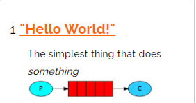
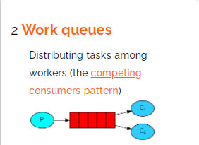
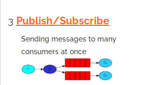
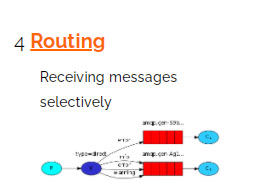
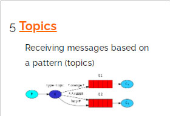
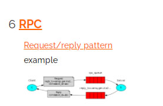

### RabbitMQ Tutorials
https://www.rabbitmq.com/getstarted.html
http://localhost:15672

### example_1. "Hello World!"
>The simplest thing that does something

>

simple Queue's
Producer -> Consumer  в очередь скидываются задачи, которые не могут выполниться сразу и забираются из одной очереди по порядку.

### example_2. Work queues "кто первый взял, того и тапки.." 
>Distributing tasks among workers  

Queue's at one ImageProducer - many  Image_Download_Consumer's ...
IMAGES_QUEUE 
Одна очередь - несколько consumer's. Задача снимается consumer-ом ее забравшим.
  
  
  
  
### example_3. Publish/Subscribe  "Exchange: fanout  Каждому consumer-ру - по очереди!"
>Sending messages to many consumers at once
>копия задачи (message's) идет во все подключенные через Exchange -> к очереди 

>например, паспортные данные идут во все очереди.. но с одной consumer снимает 'регистрацию', с другой - 'личн.данные'..

Exchange type's: direct topic headers -> fanout !!

Exchange (fanout), назначенные очереди для Consumer's.
Каждая задача раздается на каждую очередь каждого Consumer-ра. Снимается consumer-ом.

### example_4. Routing  "Exchange: direct  отправка message по конкретному 'key'" 
>Receiving messages selectively
>>копия задачи (message's) идет во все подключенные через Exchange -> к очереди  ! ПОД установленным КЛЮЧОМ

Exchange type's: direct

Каждая задача раздается на ВСЕ очереди, которым соответствует routingKey! Снимается consumer-ом.
Одна очередь/consumer просто закачивает jpg(jpeg), другая - трансформирует png -> в jpg и тоже закидывает в /downloader.

**ImagesPngDownloader, например - слушает конкретно свою назначенную routingKey очередь!
ImageProducer раскидывает задачи по ключу на очереди.

### example_5. Topics  "Exchange: topics  отправка message в определенные очереди по конкретному 'key-паттерну'" 
>Receiving messages based on a pattern (topics)
>>

Exchange type's: topics

... похоже, но:  ImageProducer раскидывает задачи по binding-key's (ключу сотверствует какой-то паттерн:  *.orange.* 
                                                                   напрмер, в URL задачи)
так, сообщение quick.orange.rabbit - попадет в очередь Q1 под определенным биндингом  *.orange.*
               lazy.orange.elefant - попадет в две очереди.
               
 Producer даже не распределяет message's по очередям, а посылает в Rabbit сообщение с key по паттерну типа
               "files.documents.pdf".

### example_6. RPC  "клиент отправляет задачу и получает результат у себя (в java-code)"
###                 распределенные вычисления   
>Request/reply pattern
>>

Exchange -НЕТ! 
Очередь задач calls - общая для всех!

каждый запрос имеет свою очередь и ответы (по id-запроса) 

Example:
Клиент 1 -> задача 1 (correlationId = 777), задача 2 (correlationId = 778), ... 
Клиент 2 -> задача 3 (correlationId = 888), задача 4 (correlationId = 889), ... 

Клиент 1
          ->  calls очередь:   задача 1, задача 2, задача 3, задача 4 ...  (correlationId, replayTo)
Клиент 2

Сервер ->     ответ на задачу 1, ответ на задачу 2 -> в очередь клиент'а 1
              ответ на задачу 3, ответ на задачу 4 -> в очередь клиент'а 2
              
              Чтобы зачачи не терялись в между клиентами - для них создаются отдельные очереди
              Чтобы задачи не терялись в очереди - correlationId.
              
              
В calls закидываются задачи (https://klike.net/uploads/posts/2018-07/1531483268_31.jpg  пробел), и
              в консоли каждого клиента получаем size как ответ.              
              
              

